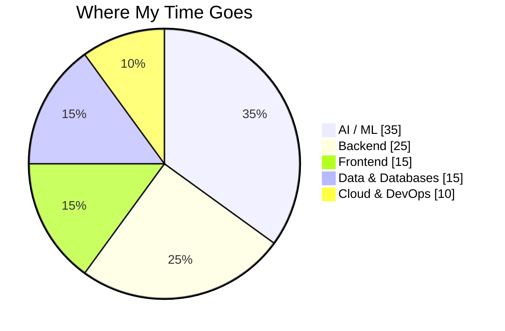

<h1 align="center">Hey, I'm Devang </h1>

<h3 align="center">AI/ML Engineer | Full-Stack Developer | Python • Java • React</h3>

  

  
  

I'm a final-year Computer Science student at RCOEM who enjoys building AI-powered applications that combine machine learning, backend engineering, and real-world data.

I like taking projects beyond notebooks — from training ML models and building NLP/CV pipelines to designing APIs, databases, real-time systems, and deployable applications.

---

## 🧠 What I Build

- 🤖 AI/ML systems using Deep Learning, NLP, Computer Vision & GenAI
- ⚙️ Backend services and REST APIs with Python, FastAPI, Node.js & Spring Boot
- 🌐 Full-stack applications with React, TypeScript & modern web technologies
- 📊 Data-driven systems involving real-time data, ML inference & analytics
- ☁️ Containerized and cloud-deployed applications using Docker & AWS
- 🧩 Algorithmic problem solving with Java & Data Structures

---

## 🚀 Featured Projects

### 🌍 [Geotrix — GeoTrade AI Platform](#)

An AI-powered geopolitical intelligence and quantitative trading platform that transforms global events and news into market risk signals.

**Highlights**
- Global Tension Index (GTI) generated from geopolitical events
- NLP pipeline for entity extraction, sentiment & event clustering
- ML-based BUY / HOLD / SELL predictions
- Risk analysis using Monte Carlo simulation, VaR & Expected Shortfall
- FAISS-based semantic search and vector retrieval
- Real-time dashboard with interactive maps and 3D globe

**Stack:** Python • FastAPI • PyTorch • XGBoost • Transformers • FAISS • SQLAlchemy • React • TypeScript • Three.js

---

### 🛡️ [SHIELD — AI Security Platform](#)

A multi-component AI-powered security platform combining machine learning, NLP, real-time processing and graph-based analysis.

**Highlights**
- AI-assisted security analysis
- Computer vision and NLP pipelines
- Real-time communication using WebSockets
- Vector search and semantic retrieval
- Graph-based relationship analysis
- Containerized backend services

**Stack:** Python • FastAPI • React • PyTorch • OpenCV • NLP • PostgreSQL • Neo4j • ChromaDB • Docker

---

### 🏥 [Kidney Health Analytics](#)

Machine learning system developed during a 12-hour ML hackathon for medical image classification. Built a custom CNN from scratch to classify images into **Cyst • Normal • Stone • Tumor**.

**Highlights**
- Custom CNN architecture without pretrained models
- Ultrasound & CT image processing
- Grad-CAM for model interpretability
- Streamlit-based prediction interface

**Stack:** Python • PyTorch • CNN • Computer Vision • Grad-CAM • Streamlit

🏆 **Top 10 — IIIT Nagpur Analytica / TantraFiesta Hackathon**

---

### 🏙️ [Citizen Connect](#)

An AI-powered civic grievance platform designed to make complaint management more transparent and efficient.

**Highlights**
- Automatic complaint categorization
- Sentiment analysis & priority prediction
- Department routing
- Admin analytics dashboard
- Telegram bot integration
- Interactive location-based grievance tracking

**Stack:** React • TypeScript • Node.js • Express • Transformers • Groq • Turso/libSQL • Leaflet

---

## 🛠️ Tech Stack

  
  
  
  
  

  
  
  
  
  
  
  

  
  
  
  
  
  
  
  

### Skill Distribution

---

## 📚 Currently Working On

- 🧠 Data Structures & Algorithms
- 🤖 Deep Learning & Generative AI
- ⚙️ Backend & system design
- ☁️ Cloud deployment and infrastructure
- 🔬 Building more reliable and production-oriented AI systems

---

## 🏆 Highlights

- 🎓 Final-year Computer Science student at RCOEM
- 📈 CGPA: **8.56**
- 🥇 Top 10 at IIIT Nagpur ML Hackathon
- 🤖 Built multiple end-to-end AI/ML applications
- 🔧 Experience across ML, backend and full-stack development

---

## 📊 GitHub Stats

  
  

  

---

## 🤝 Connect With Me

  
  

